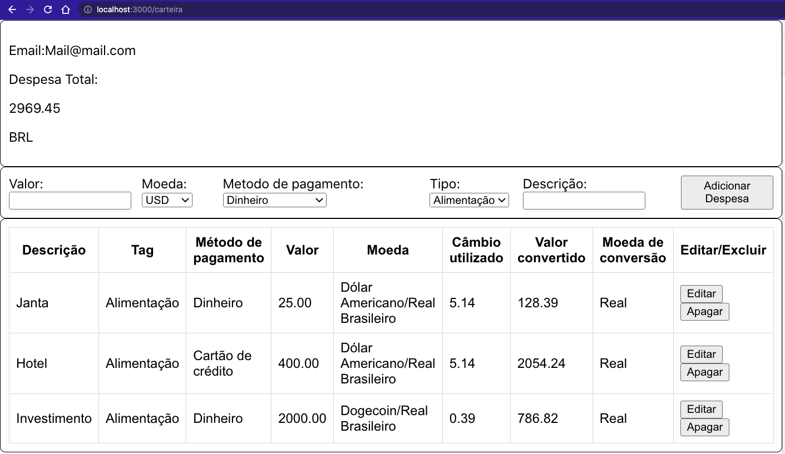

# 🚧 README em construção ! 🚧

# TrybeWallet

Projeto desenvolvido no modulo de Front End no curso da Trybe.

O TrybeWallet consiste em uma carteira de gastos com cotações de diferentes moedas. Utilizei React Redux e uma API para cotações de moedas, também fiz algumas coberturas de testes em funções assincronas com Redux.
## Tecnologias e habilidades usadas

 - Javascript, HTML e CSS
 - React
 - Redux 
 - CRUD
 - API de cotação de moedas [AwesomeAPI](https://docs.awesomeapi.com.br/)
 - Testes unitários com RTL
## Funcionalidades e resultados

- Login com email e senha
- Validações de login
- Selecionar: 
    - Valor da despesa
    - Escolher moeda
    - Metodo de pagamento
    - Tipo de despesa
    - Descrição 
- Adicionar nova despesa
- Editar despesa
- Excluir despesa

A interface da pagina ainda esta em desenvolvimento, por enquanto só existe uma estrutura em HTML como na imagem abaixo: 

Todos os arquivos desenvolvidos por mim estão dentro da pasta `src`, os restantes, são arquivos de configuração ou arquivos desenvolvidos pela Trybe
## Como rodar 🚀

Caso queira executar esse projeto em sua máquina você pode:
 * Fazer o clone desse repositório 
 * Instalar as dependências utilizando rodando em seu terminal `npm install`
 * Executar o comando `npm start` para rodar a aplicação React
 * Por fim, abrir a pagina em seu navegador pela url `localhost:3000`
## Autor

**Melqui Brito de Jesus**

Linkedin: https://www.linkedin.com/in/melqui-brito-871676188/

Telegram: https://t.me/Merkulino

Email: Merkulino11@gmail.com

:shipit: 
